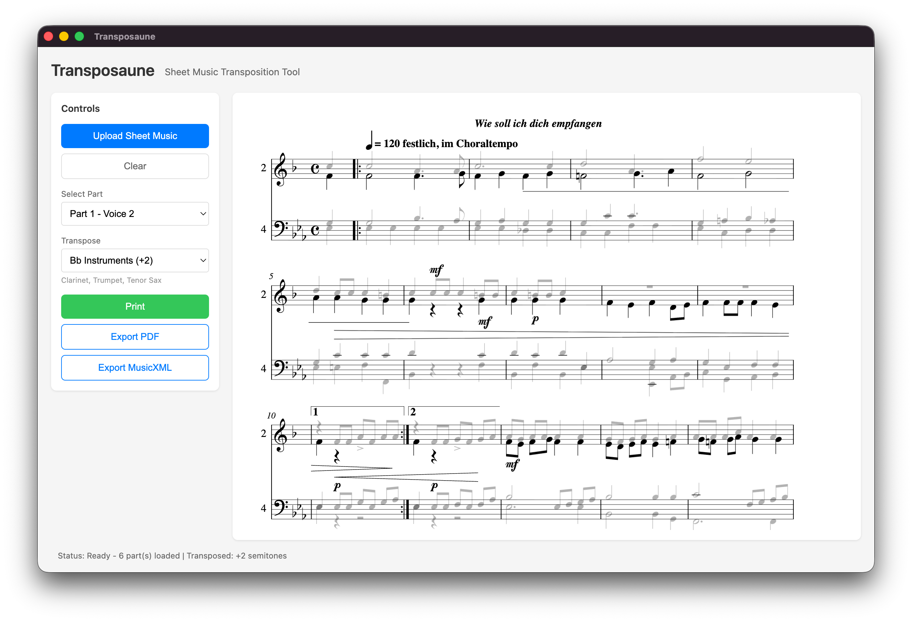

# Transposaune

Sheet music transposition app with Optical Music Recognition (OMR) using Audiveris.



## Features

- Upload scanned sheet music (PDF, PNG, JPG)
- Automatic OMR processing via bundled Audiveris
- Select specific parts from SATB scores
- Transpose for different instruments (Bb presets + custom semitones)
- Print with highlighted selected part
- Export to PDF

## Development Setup

### Prerequisites

- Node.js 18+ and npm
- For macOS development: Xcode Command Line Tools
- For Windows development: Visual Studio Build Tools
- For Linux development: standard build tools

### Installation

1. Clone the repository
```bash
git clone <repo-url>
cd transposaune
```

2. Install dependencies
```bash
npm install
```

3. Setup Audiveris (downloads ~120MB: 58MB JARs + ~50MB JRE)
```bash
# For current platform only
npm run setup:audiveris

# Or for all platforms (for building releases)
npm run setup:audiveris:all
```

This will:
- Download Audiveris 5.9.0 JAR files (cross-platform)
- Download platform-specific native libraries (leptonica, tesseract)
- Download Azul Zulu JRE 25 for your platform
- Create wrapper scripts for launching

**Why this approach?**
- Core JAR files are cross-platform (~58MB, shared)
- Native libraries are small (~5MB per platform)
- JRE is platform-specific (~50MB each)
- Total size: ~120MB per platform vs 400MB with full installers (3x smaller)

### Running in Development

```bash
npm run dev
```

### Building

```bash
# Build for current platform
npm run package

# Installers will be in release/ directory
```

## Project Structure

- `src/main/` - Electron main process
  - `audiveris.ts` - OMR integration
  - `ipc-handlers.ts` - IPC communication
- `src/renderer/` - React UI
- `src/preload/` - Preload script for secure IPC
- `resources/` - App icons and Audiveris binaries
- `scripts/` - Build and setup scripts

## Technology Stack

- **Electron** - Cross-platform desktop framework
- **React** - UI library
- **TypeScript** - Type-safe development
- **Vite** - Fast build tool
- **Audiveris** - OMR engine (bundled with JRE)
- **OpenSheetMusicDisplay** - MusicXML rendering

## How It Works

1. **Upload**: User uploads scanned sheet music
2. **Preprocessing**: Advanced image enhancement for better OMR quality
   - **Perspective correction**: Automatically detects and flattens angled/curved photos
   - **Adaptive binarization**: Handles uneven lighting better than simple thresholding
   - **Deskewing**: Auto-detects and corrects rotated images
   - **Contrast enhancement**: Improves staff line detection
3. **OMR**: Audiveris processes image → MusicXML
4. **Display**: OpenSheetMusicDisplay renders the score
5. **Select**: User picks instrument part (Soprano/Alto/Tenor/Bass)
6. **Transpose**: Apply transposition (e.g., -2 semitones for Bb trumpet)
7. **Print**: Generate print-optimized view with highlighted part

## Image Quality Tips

For best OMR results:
- **Camera photos work!** The app automatically corrects perspective distortion from angled shots
- Take photos with good lighting (natural daylight is best)
- Avoid shadows across the page
- Keep the entire page in frame
- Higher resolution is better (but images are auto-normalized to optimal size)

## License

MIT
